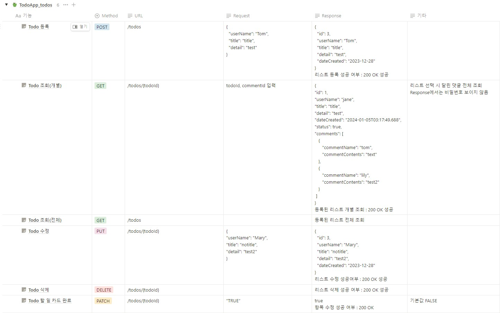
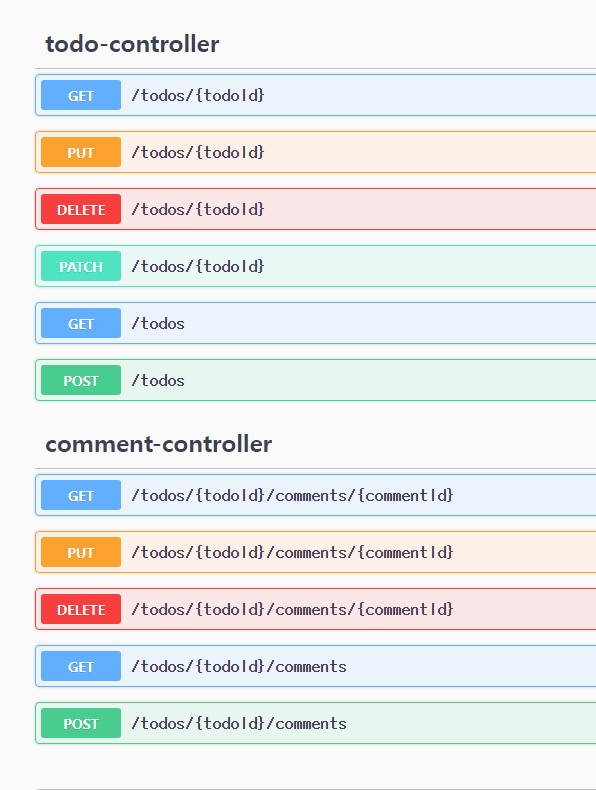

TodoApp
=============
TodoList Application의 백엔드 서버 만들기 과제입니다.

프로젝트 설명
-------------
* STEP 1: TodoList CRUD 구현
* STEP 2: Comment CRUD 구현, TodoList 완료 기능, 개별 TodoList와 연관 Comment 추가 

개발 환경
-------------
* 언어 : Kotlin
* JAVA 17 (JDK 17.0.9)
* IDE : IntelliJ Ultimate

Use Case Diagram
-------------

ERD
-------------

API명세서
-------------

